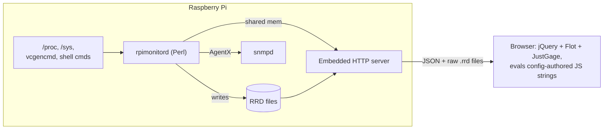

# RPi-Monitor Modernization Plan

2026-09-17 · @Someone

## What RPi-Monitor v2.13 actually is

The last real release is from 2018 (VERSION file: `2.13`); the GitHub org was only created 2026-07-14 to find volunteers to keep it alive. The whole thing is one 1,566-line Perl script (`rpimonitord`) plus a folder of `.conf` templates — no build step, no tests, no CI.

| Component          | Implementation                                                                                                                                                                   | Notes                                                                                                                                         |
| ------------------ | -------------------------------------------------------------------------------------------------------------------------------------------------------------------------------- | --------------------------------------------------------------------------------------------------------------------------------------------- |
| Collector daemon   | `rpimonitord`, single Perl file                                                                                                                                                  | Hand-rolled HTTP server (no framework), uses `IPC::ShareLite` for shared memory between its own forked processes                              |
| Metric definitions | \~40 `.conf` templates in `/etc/rpimonitor/template/` (cpu, memory, network, storage, sdcard, plus per-board files: Allwinner H3, OrangePi, sunxi, xbian, raspbmc…)              | Each metric ("KPI") is a `dynamic.N`/`static.N` entry: a source command or file, a regexp, a postprocess expression, and an optional RRD type |
| Storage            | RRDtool `.rrd` file per KPI under `/var/lib/rpimonitor/stat/`                                                                                                                    | Fixed-size ring buffers, \~1 year retention by default                                                                                        |
| Web rendering      | The _same_ `.conf` templates also carry `web.status.*` / `web.statistics.*` entries — literal JS strings like `JustGageBar(...)` that the browser `eval`s against a JSON payload | Presentation logic lives inside the data-collection config, not in code                                                                       |
| Frontend           | Static HTML + jQuery 1.x + Bootstrap 3 + Flot (canvas charts) + JustGage/Raphael (gauges) + `javascriptrrd` (parses `.rrd` binaries client-side over HTTP) + Sortable.js         | \~2013-era stack, no bundler                                                                                                                  |
| Alerting           | Config-driven threshold engine (`alert.<name>.kpi`, hysteresis via `maxalertduration` / `cancelvalidation` / `resendperiod`) that execs a shell command on raise/cancel          | e.g. a mail script                                                                                                                            |
| SNMP               | Daemon acts as an SNMP AgentX subagent, auto-numbering OIDs from `snmp.<kpi>.id` in the templates                                                                                | For integration with existing NMS tooling                                                                                                     |
| Addons             | Self-contained HTML/JS/CSS bundles in `web/addons/` (Shellinabox and Hawkeye embeds, a "top3" processes widget, an "about" page)                                                 | Loaded via `addons.json`                                                                                                                      |
| Packaging          | Debian package for Raspbian via `Makefile`; manual steps documented for other distros                                                                                            | No Docker image, no prebuilt binary                                                                                                           |

The daemon exposes `static.json`, `dynamic.json`, `status.json`, `statistics.json`, `menu.json`, `friends.json`, `addons.json` and `version.json`; the browser polls these and evaluates the embedded JS strings to build the page.

## How it fits together, and why it's hard to keep going



What makes a 2026 rewrite worthwhile rather than a patch job:

1. **Monolithic, untested Perl.** One 1,566-line file, no tests, no CI — any change is a leap of faith.
2. **Presentation baked into config.** HTML/JS fragments live as strings inside `.conf` files and get `eval`'d in the browser. No separation between "what to collect" and "how to render it," and it's awkward to diff or version.
3. **RRD as the only store.** Schema and rollup resolution are fixed at file-creation time; there's no easy path to ad-hoc queries or exporting raw history beyond what RRD already rolled up.
4. **A 2013 frontend.** jQuery 1.x, Flot, unminified Raphael, no bundler, no dark mode, a layout that predates modern responsive design.
5. **No container story.** Debian package only — nothing you can `docker compose up` to try it, which is how you run almost everything else today.
6. **No automated tests or CI** — nothing to build confidence on before a change ships.
7. **Mostly dormant upstream.** Board templates still cover devices like Raspbmc that haven't mattered in years.
8. **Loose security model.** Alert raise/cancel commands and postprocess expressions are shell/Perl strings evaluated at runtime — fine for a single trusted operator, but not something to extend carelessly.

## New system: decisions and why

| Decision      | Choice                                                     | Why                                                                                                                                                                                                 |
| ------------- | ---------------------------------------------------------- | --------------------------------------------------------------------------------------------------------------------------------------------------------------------------------------------------- |
| Scope         | Single device, 1:1 replacement                             | Matches the original; simplest correct architecture, and the plugin-based design below leaves room to grow into a fleet view later without a rewrite                                                |
| Runtime       | Node.js + TypeScript                                       | One language across collector, API, and frontend; the `systeminformation` npm package covers most `/proc`/`/sys` parsing the Perl script does by hand; you already have React experience to draw on |
| Storage       | SQLite (via built-in `node:sqlite`), WAL mode              | Embedded, zero ops, plain SQL for ad-hoc queries and exports — no RRD-style fixed rollups decided up front                                                                                          |
| Deployment    | Both a native systemd service and an official Docker image | Matches how you run most of your homelab (Dockhand/Compose) while keeping a low-overhead native option close to how your Pi-hole box runs today                                                     |
| API framework | Fastify (TypeScript-first, lightweight)                    | Small footprint suits a Pi; typed routes reduce the class of bug you'd otherwise catch in QA                                                                                                        |
| Frontend      | Preact + Vite, built to static assets served by the API    | React-compatible (reuses your React/JSX experience) at \~3 KB runtime — see "Frontend alternatives" below; no server-side rendering needed for a single-device dashboard                            |
| Charts        | A maintained canvas/SVG library (e.g. uPlot or Recharts)   | Replaces Flot; better performance and touch support on a Pi-class CPU, no jQuery dependency                                                                                                         |

Suggested repo layout inside `PiPulse` (a TypeScript workspace, e.g. npm/pnpm workspaces):

```
PiPulse/
  packages/
    collector/   # metric plugins + scheduler
    storage/     # SQLite schema, migrations, query helpers
    api/         # Fastify HTTP + WebSocket server
    web/         # Preact + Vite dashboard
  deploy/
    systemd/     # unit file, install script
    docker/      # Dockerfile, compose.yml
```

## Data collection & storage design

**Collector plugins** replace the free-text `.conf` KPI declarations. Each plugin is a small TypeScript module exporting a manifest (id, label, unit, poll interval) and a `collect()` function:

- Standard metrics (CPU load/frequency, memory, network throughput, disk/SD card usage, temperature) come from the `systeminformation` package instead of hand-parsing `/proc`.
- Pi-specific metrics (`vcgencmd measure_volts`, throttling flags, GPIO/sensor reads) stay as small shell-out plugins, same idea as the original but isolated and typed instead of a regexp + postprocess string.
- Alerts become a rules engine reading the same values (`condition`, `raiseAfter`, `cancelAfter`, `resendEvery` — same hysteresis concept as today's `maxalertduration`/`cancelvalidation`/`resendperiod`) with sandboxed actions (webhook, shell, log) instead of raw eval'd strings. Since you already run **Apprise** in your homelab, a webhook-to-Apprise action would plug straight into your existing notification setup.

**Storage schema** (SQLite, WAL mode for concurrent collector-writes / API-reads):

```sql
CREATE TABLE metrics (
  ts     INTEGER NOT NULL,   -- unix ms
  metric TEXT NOT NULL,
  value  REAL,
  PRIMARY KEY (metric, ts)
);
CREATE INDEX idx_metrics_metric_ts ON metrics(metric, ts);

CREATE TABLE metrics_rollup (
  ts         INTEGER NOT NULL,  -- bucket start, unix ms
  metric     TEXT NOT NULL,
  resolution TEXT NOT NULL,     -- '1m' | '1h' | '1d'
  avg REAL, min REAL, max REAL,
  PRIMARY KEY (metric, resolution, ts)
);
```

A scheduled job downsamples raw rows into `metrics_rollup` and prunes old raw data — the same spirit as RRD's rollups, but explicit, queryable, and tunable rather than fixed at file-creation time.

**Update (Phase 4, daily rollups):** daily buckets are the server's local calendar days (23 or 25 hours across DST), built from 1-minute rollups. Because a local day's end depends on the timezone it was cut in, a `rollup_progress (resolution, until)` table (schema version 3) records where daily rollups stopped; the next run continues from exactly there and merges any partial day into its row, so a timezone change never recounts or skips data.

**Update (Phase 0, storage engine):** shipped with `better-sqlite3` initially, then swapped to Node's built-in `node:sqlite` (`DatabaseSync`) after a real npm bug ([npm/cli#9450](https://github.com/npm/cli/issues/9450)) made it impossible to selectively allow just `better-sqlite3`'s install script under `ignore-scripts=true` — a security setting kept on for good reason. `node:sqlite` needs Node 22.13+/24+ (bumped `engines.node` accordingly, CI now runs 22.x/24.x instead of 20.x/22.x) and has no install step at all, so this class of failure can't recur. `openDb`/`insertSample`/`getLatest`/`getHistory` are unchanged; only the internals moved.

## API and web frontend

**HTTP API** (Fastify):

- `GET /api/metrics/latest` — current value of every KPI (replaces `dynamic.json`)
- `GET /api/metrics/:id/history?from=&to=&resolution=` — raw or rolled-up series for a chart (replaces the client fetching raw `.rrd` files)
- `GET /api/config` — device info, registered plugins (replaces `static.json`/`menu.json`)
- `GET /api/alerts` — active and historical alerts
- A **WebSocket** channel pushes new samples as they're collected — the dashboard updates live instead of polling `dynamic.json` on a timer, a real UX upgrade over the original.

**Frontend** (Preact + Vite, built to static assets the API serves):

- **Dashboard** page — status cards per KPI, live via the WebSocket (replaces `status.html`)
- **History** page — zoomable time-series charts per metric group (replaces `statistics.html`)
- **Alerts** page — active/past alerts and their rules
- **Settings** page — device info; storage usage per resolution; an editable retention policy (see "Keeping storage bounded"); alert channels shown read-only (alert actions stay operator-defined in a config file, see "Security considerations")
- Mobile-responsive and dark-mode-aware from the start via CSS variables — neither existed in the 2013-era Bootstrap 3 layout.

## Deployment: systemd and Docker

**Native systemd service** — the low-overhead path, close to how your Pi-hole/Unbound box runs today:

- Runs as an unprivileged `pi-monitor` user
- `ExecStart=/usr/bin/node /opt/pi-monitor/dist/server.js`, `Restart=on-failure`
- `ReadWritePaths=/var/lib/pi-monitor` for the SQLite file, everything else read-only
- An install script (or a `.deb`/`.rpm` later) replaces the old Debian package

**Docker image** — matches how you run almost everything else (Dockhand/Compose):

- Multi-stage build: stage 1 compiles TypeScript and builds the Preact app, stage 2 is a slim `node:22-alpine` runtime (Node >=22.13 is required for `node:sqlite`)
- Bind-mount a `/data` volume for the SQLite file
- **Design risk to resolve early:** a _containerized system monitor_ needs visibility into the _host's_ `/proc`, `/sys`, and network stats, not the container's own. Plan to bind-mount `/proc` and `/sys:ro` and run with `pid: host` (and likely `network_mode: host` for accurate network counters) — call this out in the compose file's comments so it isn't mistaken for over-privileging later.

**CI**: since this is a clean-slate repo, set up multi-arch builds (`linux/arm64` + `linux/arm/v7`, since Pi 3/4/5 differ) from day one via GitHub Actions — a smaller version of the pipeline architecture you already build professionally.

## Feature parity vs. legacy RPi-Monitor

| Legacy feature                                                        | New plan                                                                                                                                                                                                                                                                                                                                                                        |
| --------------------------------------------------------------------- | ------------------------------------------------------------------------------------------------------------------------------------------------------------------------------------------------------------------------------------------------------------------------------------------------------------------------------------------------------------------------------- |
| Status page (instant values)                                          | Preact Dashboard page, WebSocket-driven                                                                                                                                                                                                                                                                                                                                         |
| Statistics page (historical graphs, zoom)                             | Preact History page, SQLite-backed queries, modern zoomable chart lib                                                                                                                                                                                                                                                                                                           |
| CPU / memory / network / storage / temperature KPIs                   | Ported via `systeminformation` plus a Pi-specific `vcgencmd` plugin                                                                                                                                                                                                                                                                                                             |
| Load averages (1/5/15 min) and cumulative network totals since boot   | Deliberately reshaped, not ported 1:1: only the 1-minute load is collected (`load_1`, every 30 s), charted on History beside CPU load with the core count marked, and kept off the live page; 5/15-min are smoothings of it. Totals since boot reset on reboot, so History instead shows bytes moved in the selected range, rebuilt from the stored rates (no extra collection) |
| Board-specific templates (Allwinner, OrangePi, sunxi, xbian, raspbmc) | Not carried over 1:1 — scope is your Pi only; the plugin model leaves the door open later                                                                                                                                                                                                                                                                                       |
| Config-driven KPI/alert definitions                                   | TypeScript plugin + rules files, no free-text `eval`                                                                                                                                                                                                                                                                                                                            |
| Alerting with hysteresis + raise/cancel commands                      | Rules engine, same hysteresis concept, sandboxed actions (webhook/shell/log)                                                                                                                                                                                                                                                                                                    |
| Read-only mode                                                        | Config flag disables the SQLite writer; API still serves last-known values                                                                                                                                                                                                                                                                                                      |
| JSON export of metrics                                                | REST endpoints kept and expanded                                                                                                                                                                                                                                                                                                                                                |
| SNMP integration                                                      | Open question — see next section; not in v1 unless you confirm you need it                                                                                                                                                                                                                                                                                                      |
| Addons (Shellinabox, Hawkeye, top3, about)                            | Dropped from core; a documented extension point (iframe/plugin slot) replaces ad hoc eval'd JS                                                                                                                                                                                                                                                                                  |
| Drag-and-drop dashboard layout                                        | Nice-to-have for v2, not blocking v1                                                                                                                                                                                                                                                                                                                                            |
| Debian package                                                        | Replaced by a systemd unit + install script, plus a Docker image                                                                                                                                                                                                                                                                                                                |

## Step-by-step build plan

| Phase                      | Goal                                     | Key deliverables                                                                                                                                                                                                                                                                                                                           | Exit criteria                                                                                                                                                                                                                                    |
| -------------------------- | ---------------------------------------- | ------------------------------------------------------------------------------------------------------------------------------------------------------------------------------------------------------------------------------------------------------------------------------------------------------------------------------------------ | ------------------------------------------------------------------------------------------------------------------------------------------------------------------------------------------------------------------------------------------------ |
| 0. Foundations             | Get a clean TypeScript workspace running | ✅ Done. `PiPulse` scaffolded with the `collector`/`storage`/`api`/`web` packages, lint + test runner, GitHub Actions skeleton                                                                                                                                                                                                             | `npm test` and `npm run build` succeed in CI                                                                                                                                                                                                     |
| 1. Collector core          | Prove the plugin model end to end        | ✅ Done. Plugin API, CPU/memory/network/storage/temperature plugins via `systeminformation`, SQLite writer                                                                                                                                                                                                                                 | Raw metric rows land in SQLite on a real Pi at the configured interval                                                                                                                                                                           |
| 2. API layer               | Serve what's collected                   | ✅ Done. Fastify REST endpoints (`latest`, `history`, `config`), WebSocket push channel                                                                                                                                                                                                                                                    | `curl` and a WebSocket client both return live data                                                                                                                                                                                              |
| 3. Dashboard               | Status-page parity                       | ✅ Done. Preact Dashboard page consuming the WebSocket feed                                                                                                                                                                                                                                                                                | Visually matches or beats the original `status.html` on the same device                                                                                                                                                                          |
| 4. History & charts        | Statistics-page parity                   | ✅ Done. Preact History page, zoomable charts, the rollup/downsampling job                                                                                                                                                                                                                                                                 | A year-old-equivalent of data renders without loading the full raw table                                                                                                                                                                         |
| 5a. Alerting               | Reimplement the rules engine             | ✅ Done. `packages/alerts`: built-in rules merged with an operator `PIPULSE_ALERTS_FILE`, raise/clear hysteresis (`for`/`clearAfter`), a 15 s engine that survives restarts and clock jumps, the `alerts` table (schema migration 4), `GET /api/alerts` and live `alert` messages, tiles coloured from rules, an Alerts page and nav badge | A manufactured breach on the Pi raises an alert that appears live on the dashboard, survives a restart without duplicating, and clears after its clear window                                                                                    |
| 5b-1. Settings             | Make retention editable, safely          | ✅ Built (Pi exit criterion pending). Sign-in against an scrypt hash file, in-memory sessions, one auth hook (writes always, reads optionally), `settings` table (migration 5), retention env › saved › default applied live, preview + confirmation before deleting, automatic `VACUUM`, Settings page                                    | Read-only without a password; an unauthenticated write is rejected; a retention change made in the UI applies within a minute without a restart and survives one; a large deletion shrinks the file; read protection shows only the sign-in form |
| 5b-2. Rules in the browser | Make alert rules editable                | Add/edit/disable rules stored above the file and built-ins, acknowledging alerts, `swap_heavy` revisited                                                                                                                                                                                                                                   | Tests pass in CI; a rule edited in the UI applies without a restart                                                                                                                                                                              |
| 5b-3. Notifications        | Tell someone who isn't looking           | Webhook (e.g. Apprise) on the engine's `onChange` seam                                                                                                                                                                                                                                                                                     | An alert raised on the Pi arrives through the webhook                                                                                                                                                                                            |
| 6. Packaging               | Make it installable                      | systemd unit + install script, multi-stage Dockerfile, multi-arch CI build                                                                                                                                                                                                                                                                 | Fresh install works both ways on a real Pi                                                                                                                                                                                                       |
| 7. Cutover                 | Retire the legacy daemon                 | Run both side by side, compare readings, decommission `rpimonitord`                                                                                                                                                                                                                                                                        | New system has run unattended for a full week with no data gaps                                                                                                                                                                                  |

## Risks, open questions, next steps

**Open questions:**

- **SNMP** — do you actually rely on it today from an NMS or the NAS? Nothing in your current homelab setup points to active SNMP monitoring, so the recommendation is to defer it unless you confirm a need.
- **Alert channel for v1** — a webhook into **Apprise** (already running in your homelab) is the natural default; confirm that's the right first target versus email or a plain dashboard banner.
- **Retention policy** — resolved in Phase 4: raw 2 days, 1-minute 14 days, hourly 1 year, daily forever (~35 MB on an SD card), overridable with `PIPULSE_RETENTION_RAW` / `_1M` / `_1H` / `_1D`.
- **Authentication for Phase 5** — resolved in the 5b-1 design (`docs/superpowers/specs/2026-09-23-settings-auth-design.md`): built-in sign-in against an scrypt hash read from `PIPULSE_ADMIN_PASSWORD_HASH_FILE`, in-memory `HttpOnly`/`SameSite=Strict` session cookie, every write authenticated, optional read protection (`PIPULSE_PROTECT_READS`), read-only when no password is configured. Reverse-proxy support is deferred (see [Future: behind a reverse proxy](#future-behind-a-reverse-proxy)).
- **Docker host-visibility risk** (flagged above) needs a quick spike — confirm `/proc` + `/sys:ro` + `pid: host` actually surfaces accurate host metrics from inside the container before committing to it as a first-class deployment path.

**Immediate next steps:**

1. Confirm the SNMP and alert-channel questions above.
2. Scaffold the TypeScript workspace in `PiPulse` (Phase 0).
3. Port CPU/memory/network/storage first — highest value, mirrors the original's own "page 1."
4. Get raw data flowing end to end (collector → SQLite → API → a minimal dashboard) before building out alerting or packaging.

## Testing strategy

Gap in the original (zero tests) — closed from day one, not bolted on later:

| Layer              | Tool                                                                             | What it covers                                                                                                  |
| ------------------ | -------------------------------------------------------------------------------- | --------------------------------------------------------------------------------------------------------------- |
| Collector plugins  | Vitest                                                                           | Mock `/proc`, `/sys`, `vcgencmd` output; assert parsed values and edge cases (missing sensor, malformed output) |
| Storage            | Vitest + an in-memory/temp SQLite file                                           | Schema migrations, rollup/downsample correctness, retention pruning                                             |
| API                | Fastify's built-in `inject()`                                                    | Route contracts, validation, error responses — no real server needed                                            |
| End-to-end         | Playwright (already in your toolbox)                                             | Dashboard loads, live values update over the WebSocket, history charts render                                   |
| Test-suite quality | Optional: Stryker (JS equivalent of the Pitest mutation testing you already use) | Confidence the tests actually catch regressions, not just that they pass                                        |

Make "tests pass in CI" an explicit exit criterion for every phase in the build plan above, not just Phase 0.

## Security considerations

The legacy daemon has no authentication and executes config-supplied strings (postprocess expressions, alert raise/cancel commands) at runtime — fine only because it sits on a trusted LAN behind no exposed port. The rewrite should keep that safety property deliberately, not by accident:

- **No arbitrary eval.** Collector and alert-action logic is compiled TypeScript, not strings evaluated at runtime — this alone removes the injection class the original relies on operator trust to avoid.
- **Add real authentication.** The original has none. Done in 5b-1: a password stored only as an scrypt hash in an operator-owned file, `HttpOnly`/`SameSite=Strict` session cookies, a sign-in rate limit, every write authenticated and reads optionally (`PIPULSE_PROTECT_READS`). TLS through a reverse proxy remains a later option (see [Future: behind a reverse proxy](#future-behind-a-reverse-proxy)).
- **Authenticate every write.** Settings (starting with retention) become editable from the UI in Phase 5; a write that can delete history must never be open to anyone on the LAN. Reads may stay unauthenticated, writes may not.
- **Parameterize every query.** Any endpoint taking `from`/`to`/`resolution` as input must use `node:sqlite`'s parameter binding (prepared statements), never string-built SQL.
- **Keep alert actions operator-defined only.** Webhook/shell alert actions belong in a config file you control, never in anything an API client can register or trigger — don't reintroduce a remote way to run arbitrary commands.
- **Docker privilege awareness.** Mounting `/proc`, `/sys`, and `pid: host` for accurate metrics makes that container meaningfully more privileged than a typical app container — treat it accordingly: don't expose its port to the internet, keep it LAN-only like the rest of your stack.
- **Dependency hygiene.** Lockfile plus Dependabot/Renovate; Node's ecosystem sees frequent CVEs, so keep the dependency list as small as the plan above already aims for (`systeminformation`, `fastify`, `preact`, a chart library — SQLite is built into Node, so it adds no dependency at all).

There's no LLM or natural-language input anywhere in this system, so prompt injection in that sense doesn't apply — but the underlying principle is the same one the plugin architecture already satisfies: never let external input become an executable code path.

## Frontend alternatives to React + Vite

React was suggested mainly because you already have React experience. If a smaller/faster runtime matters more than reusing that experience:

| Option                              | Client bundle                              | Trade-off                                                                                             |
| ----------------------------------- | ------------------------------------------ | ----------------------------------------------------------------------------------------------------- |
| **Preact + Vite**                   | \~3 KB, React-compatible API               | Near drop-in for React code and most React libraries — smallest footprint that still feels like React |
| Svelte / SvelteKit                  | Very small (compiles away, no virtual DOM) | Modern, less boilerplate; smaller ecosystem than React                                                |
| Solid.js                            | Very small, near-vanilla performance       | Fine-grained reactivity, JSX-like syntax; less mainstream                                             |
| Vanilla JS + Vite + a chart library | Smallest possible                          | No framework at all; more manual DOM work, viable given how simple this UI actually is                |

Note the client bundle runs in _your browser_, not on the Pi, so its weight affects load time, not the Pi's resource budget. Recommendation: **Preact** as the default — keeps your React/JSX knowledge and its library ecosystem while shipping a fraction of the runtime; React itself remains a perfectly fine choice if you'd rather stay on the exact stack you already know.

**Decision (Phase 0):** Preact + Vite was adopted — `packages/web` ships Preact with `@preact/preset-vite`. React-specific wording elsewhere in this plan has been updated to match.

## Keeping storage bounded (cleanup job)

The rollup table introduced earlier is the mechanism, made explicit here since unbounded growth was a real concern with RRD too:

- A housekeeping job (built in Phase 4: `startHousekeeping` in `packages/storage/src/rollup.ts`, run in-process by the server and the standalone collector, once at startup and then every minute via `setInterval`, no cron dependency) rolls complete buckets up raw → 1m → 1h → 1d, then deletes each resolution's rows past its retention, but only rows the next level already covers, so nothing is lost if a rollup falls behind. Default retention: raw 2 days, 1-minute 14 days, hourly 1 year, daily forever (~35 MB), overridable with `PIPULSE_RETENTION_RAW` / `_1M` / `_1H` / `_1D`.
- This bounds the SQLite file size the same way RRD's fixed-size ring buffers did, but the retention numbers are config, not baked into a file format.
- Automatic compaction (5b-1): SQLite reuses pages freed by deletes but doesn't shrink the file, so after housekeeping PiPulse runs `VACUUM` when free pages are ≥ 25 % of a file over 8 MB and the disk has room for a copy, at most once a day, logging the size before and after.
- The retention settings are on the Settings page, tunable without a redeploy (built in 5b-1):
  - **Precedence:** environment variable › value saved from the UI › built-in default. A field set by an environment variable is shown locked, naming the variable, so the UI never pretends to change something a restart would undo.
  - **Persistence and live apply:** UI values are stored in a `settings` table (schema migration 5; 3 is `rollup_progress`, 4 is `alerts`); housekeeping re-reads the policy on every run, so a change applies within a minute, no restart.
  - **Destructive changes are confirmed:** shortening a retention first shows how much data the next run will delete (rows and time span per resolution) and requires an explicit confirmation; lengthening one says that already-deleted data does not come back.
  - **Sizing help:** show the database size and rows per resolution today, plus an estimate for the chosen policy, since the right answer differs a lot between an SD card and NVMe.
  - **Validation** reuses the environment-variable parser (`36h`, `14d`, `2w`, `1y`, `forever`), so the UI and the environment accept exactly the same values.

## Future: behind a reverse proxy

Today PiPulse is reached directly on its port over plain HTTP. When a TLS reverse proxy (e.g. a `.lan` Caddy/Traefik/nginx) is put in front of it, add `PIPULSE_TRUST_PROXY=true` (default `false`):

- **What it changes:** PiPulse then believes `X-Forwarded-Proto` (marks the session cookie `Secure` when the proxy served HTTPS) and `X-Forwarded-For` (the sign-in rate limit counts attempts per real client instead of per proxy, which would otherwise lock everyone out together).
- **Why it's off by default and not in 5b-1:** without a proxy any client can send those headers, so trusting them would let it dodge the rate limit or fake HTTPS. It must only be turned on when PiPulse is reachable _solely_ through the proxy (bound to `127.0.0.1`, or ufw allowing only the proxy's address).
- **Where it fits:** Phase 6 (packaging) or whenever the proxy is set up; the install docs should cover the proxy config, the variable and restricting the port together. Optionally trust only a configured proxy address (`PIPULSE_TRUST_PROXY=192.168.1.10`) rather than any peer.

## Future: exporting to Prometheus / Grafana

Not needed for v1, and deliberately easy to bolt on later because of how storage was designed:

- Add a `/metrics` endpoint in Prometheus text format (via `prom-client`) that reads the same SQLite-backed KPIs — scrape it if you ever add Prometheus to the homelab.
- Alternatively, Grafana can read SQLite directly through its SQLite data-source plugin, skipping Prometheus entirely.
- Because every collector already writes named KPI values into one `metrics` table (rather than RRD's per-metric binary files), either export is an additive read path on top of existing data — not a redesign. Worth remembering as one more reason the SQLite schema was chosen over reproducing RRD's model.

## Future-proofing & extensibility

Two separate problems: core code shouldn't rot as frameworks churn, and new features/plugins shouldn't require touching or breaking existing ones.

- **Ports-and-adapters boundaries.** Core logic (scheduling, alert rules, rollups) depends only on small internal interfaces — never directly on Fastify, Preact, or `node:sqlite` types. Thin adapter modules translate between the interface and the real library. Swapping any one of them later touches one adapter, not the whole codebase.
- **A stable, versioned plugin API.** Collector plugins and alert actions implement one narrow interface (`CollectorPlugin`, `AlertAction`) — the _only_ contact surface between core and plugin code. That interface carries its own semver and changelog, separate from the app version, the same idea as a browser extension's manifest version. Breaking it is a deliberate, documented decision, never a side effect of a core refactor.
- **Self-contained plugin folders.** Each plugin ships as its own folder/package with a manifest (id, version, target interface version) and loads dynamically at startup — adding a plugin never means editing core files, the same model as Homebridge or Grafana plugins.
- **Contract tests, not just unit tests.** A fixed Vitest suite runs against every plugin — built-in or third-party — asserting it satisfies the plugin interface's contract. This is what catches "core changed and broke a plugin" the moment it happens, not months later.
- **Fewer, boring dependencies.** SQLite, Fastify, Preact, and `systeminformation` were picked partly _because_ they're mature and slow-moving compared to typical JS-ecosystem churn. Fewer dependencies, each more boring, means less surface area to go stale.
- **Automated, test-gated updates.** Renovate/Dependabot opens a PR on every dependency bump; the CI contract-test suite is the gate — upgrades merge only when they don't break a plugin's contract. This turns "keep dependencies current" from a manual chore into a background process.
- **Versioned schema and config.** Both the SQLite schema and the plugin config file carry a version number and a migration path (a `migrations/` folder applied on startup), so a future PiPulse release can evolve either without breaking an existing install's data.
